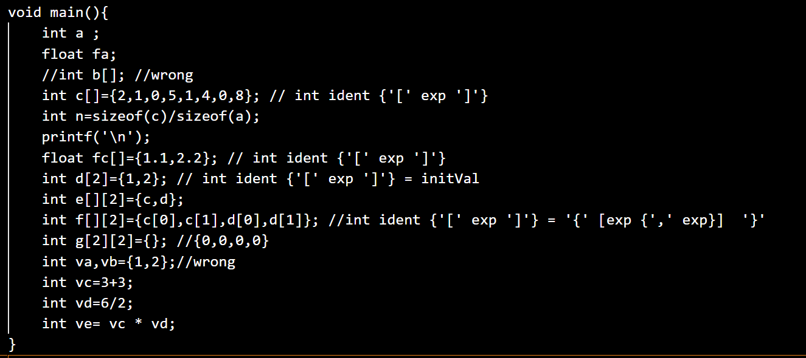
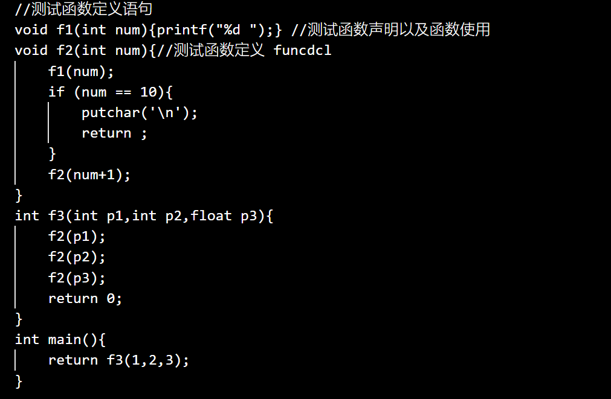
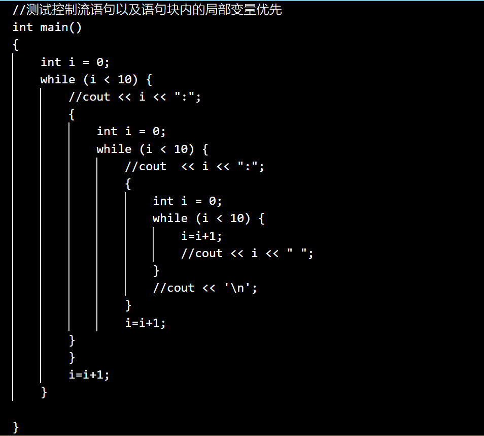
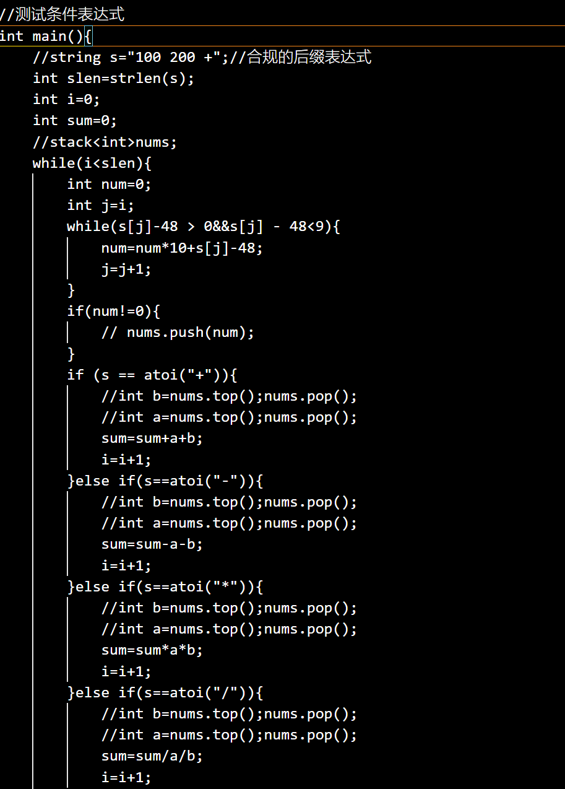
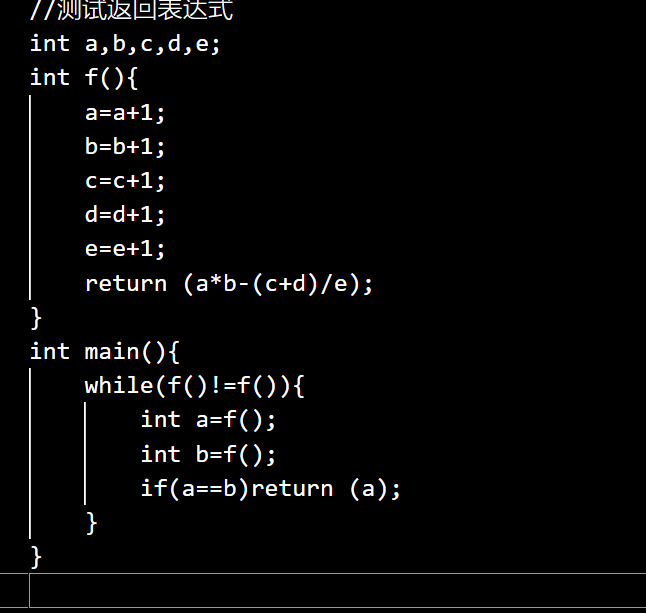
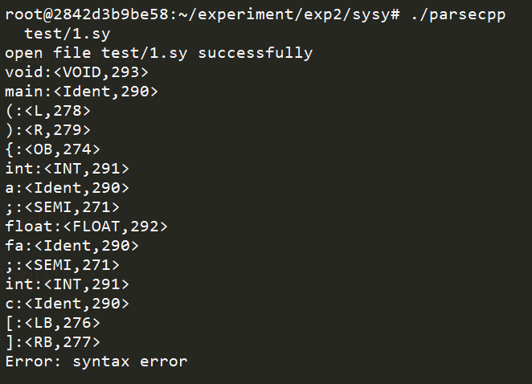
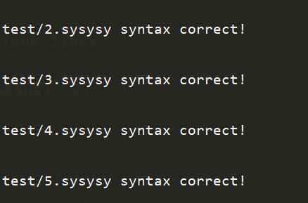

//使用检测程序 parsecpp 检测 5个测试文件

测试程序1

这段代码主要测试sysy文法的普通变量以及数组变量的定义
测试点 :
1.SysY 在声明数组时各维长度都需要显式给出，而不允许是未知的。
2.当 ConstDef 定义的是数组时，‘=’ 右边的 ConstInitVal 表示常量初始化器。
ConstInitVal 中的 ConstExp 是能在编译时求值的 int/float 型表达式
3.当 ConstDef 定义的是数组时，‘=’ 右边的 ConstInitVal 表示常量初始化器。
ConstInitVal 中的 ConstExp 是能在编译时求值的 int/float 型表达式，其中可
以引用已定义的符号常量

测试点:
1. 检测函数声明和定义语法
2. 检测函数形参和实参是否合法
3. 检测函数调用是否正常

测试点:
1. 检测控制流语句块
2. 检测条件表达式
3. 检测重名变量在代码块中的优先级

测试点:
1. 检测条件表达式

测试点:
1. 检测return表达式
2.
检测指令
./parsecpp  1.sy
./parsecpp 2.sy 3.sy 4.sy 5.sy
检测结果

